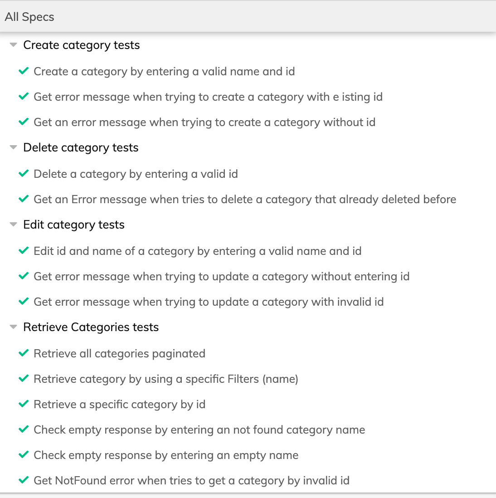

# Testing BestBuy API with Cypress.io

## Description

This repository is for automating BestBuy API  using [Cypress.io](http://cypress.io/).

### Recap: **A short explanation of the provided solution :→ ([Project Board](https://github.com/Sarah-mohamd/Instabug-Challenge/projects/3))**

- Check the project Board that contains all tasks and steps to finalize project  → **[Project Board](https://github.com/Sarah-mohamd/Instabug-Challenge/projects/3)**
- The purpose of this board is to contain and track all the activities that have been run throughout solving this part, and log steps to complete.
- Also check the Pull request that have a more details for every commit and change

## Run Requirements

- Node.js
- Chrome Browser

## Run and install

- Setup the BestBuy API environment from Here → **[link](https://github.com/bestbuy/api-playground/) ,** then
- First you can install project dependencies:

```jsx
npm install
```

- You can install Cypress with node:

```jsx
npm install cypress --save-dev
```

- From the root of this project, run the following command:

```jsx
npx cypress run
```

- If you want to run from the test runner:

```jsx
npm run cypress
```

## Tools used

- Linting tools
    - [https://eslint.org/](https://eslint.org/)
    - [https://github.com/prettier/eslint-config-prettier#readme](https://github.com/prettier/eslint-config-prettier#readme)
    - [https://github.com/prettier/eslint-plugin-prettier#readme](https://github.com/prettier/eslint-plugin-prettier#readme)
    - [https://github.com/cypress-io/eslint-plugin-cypress#readme](https://github.com/cypress-io/eslint-plugin-cypress#readme)
    - [https://github.com/okonet/lint-staged#readme](https://github.com/okonet/lint-staged#readme)
- Husky
    - [https://typicode.github.io/husky/#/](https://typicode.github.io/husky/#/)
- prettier
    - [https://prettier.io/](https://prettier.io/)

# Screenshot of Project Run

