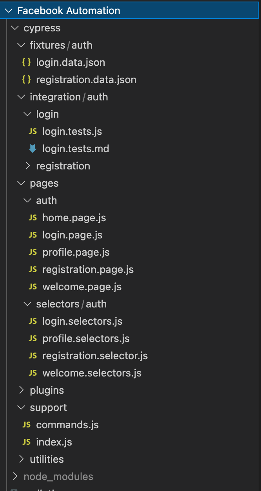
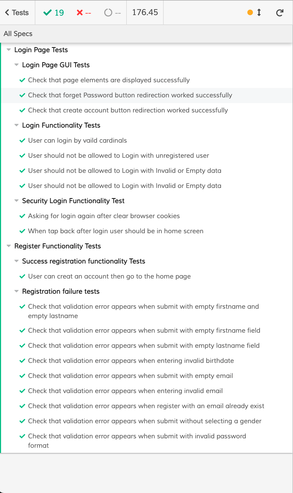

# Testing Facebook Account Creation/Login with Cypress.io

---

# Description

This repository is for automating Facebook Signup/Login tests using [**Cypress.io](http://cypress.io/). For more info about Cypress visit the following website: [**https://www.cypress.io/](https://www.cypress.io/).

Here is a **[video](https://www.loom.com/share/bf78f72b6fa54459805636db05d8a1f7)** of running all tests →  **[LOOM LINK](https://www.loom.com/share/bf78f72b6fa54459805636db05d8a1f7** 

### Recap: **A short explanation of the provided solution :→ ([Project Board](https://github.com/Sarah-mohamd/Instabug-Challenge/projects/2))**

- Check the project Board that contains all tasks and steps to finalize project  → **[Project Board](https://github.com/Sarah-mohamd/Instabug-Challenge/projects/2)**
- The purpose of this board is to contain and track all the activities that have been run throughout solving this part, and log steps to complete.
- Also check the Pull request that have a more details for every commit and change

# Run Requirements

- Node.js
- Chrome Browser

# Run and install

- First you can install project dependencies:

```jsx
npm install
```

- You can install Cypress with node:

```jsx
npm install cypress --save-dev
```

- Finally run cypress:

```jsx
npm run cypress
```

To more commands check the scripts in `pachage.json`

# Project Architecture

  Using **Page Object Model** design pattern

# Project files Structure

    Here is a File structure that have been used in the project



# Screenshot of Project Run




# Tools used

- Linting tools
    - [https://eslint.org/](https://eslint.org/)
    - [https://github.com/prettier/eslint-config-prettier#readme](https://github.com/prettier/eslint-config-prettier#readme)
    - [https://github.com/prettier/eslint-plugin-prettier#readme](https://github.com/prettier/eslint-plugin-prettier#readme)
    - [https://github.com/cypress-io/eslint-plugin-cypress#readme](https://github.com/cypress-io/eslint-plugin-cypress#readme)
    - [https://github.com/okonet/lint-staged#readme](https://github.com/okonet/lint-staged#readme)
- Husky
    - [https://typicode.github.io/husky/#/](https://typicode.github.io/husky/#/)
- Prettier
    - [https://prettier.io/](https://prettier.io/)